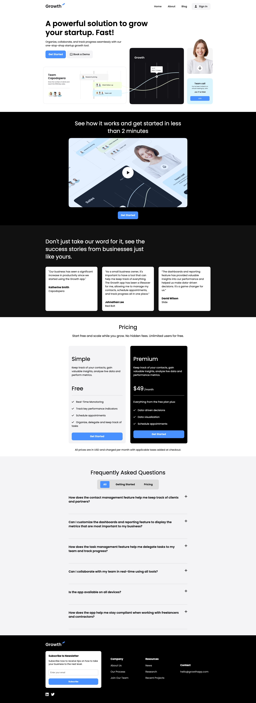

# Growth Landing Page

A responsive landing page for a SaaS company. This project does not use any frameworks or libraries. It is built with pure HTML, CSS, and a bit of JavaScript for the hamburger menu and the FAQ accordion.

Live Demo: https://growth-landing-page-demo.netlify.app/

## Screenshots

  
  

